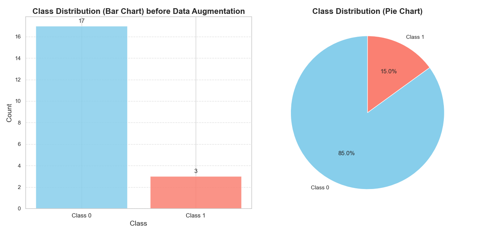
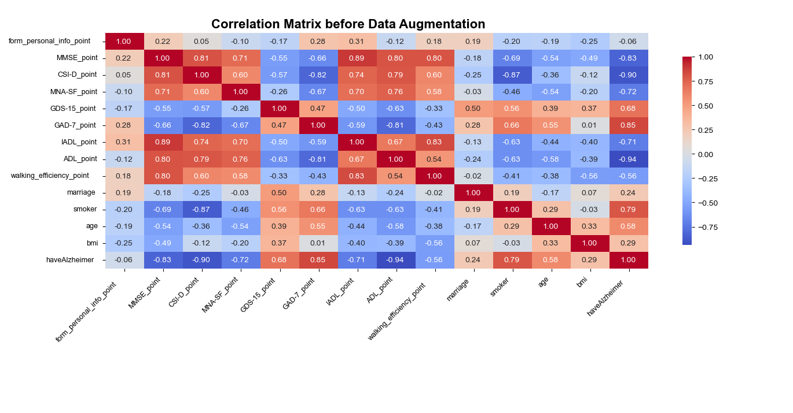
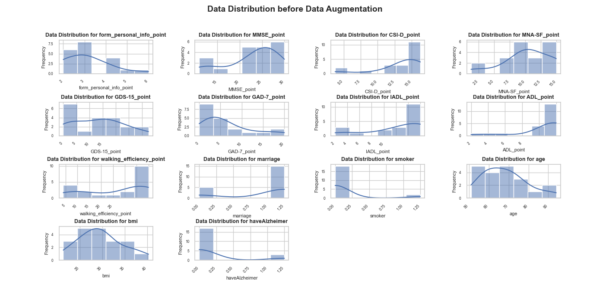
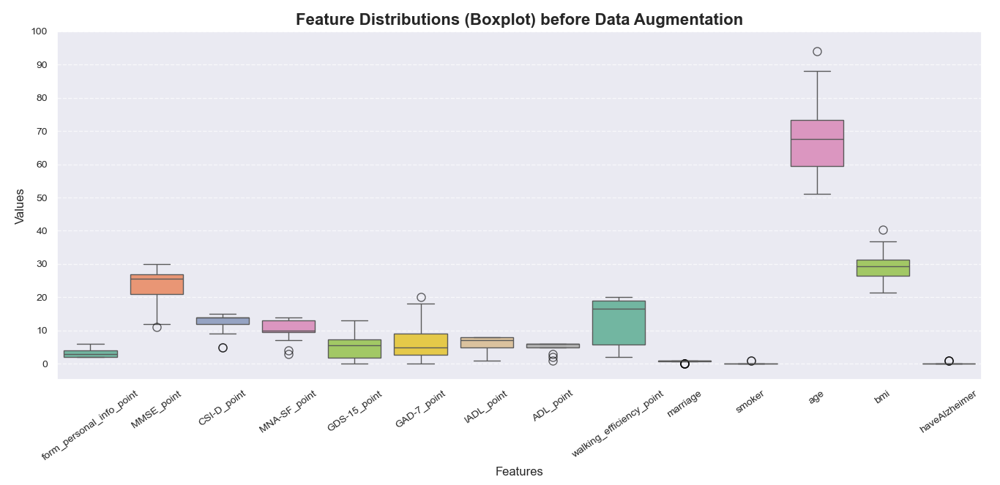
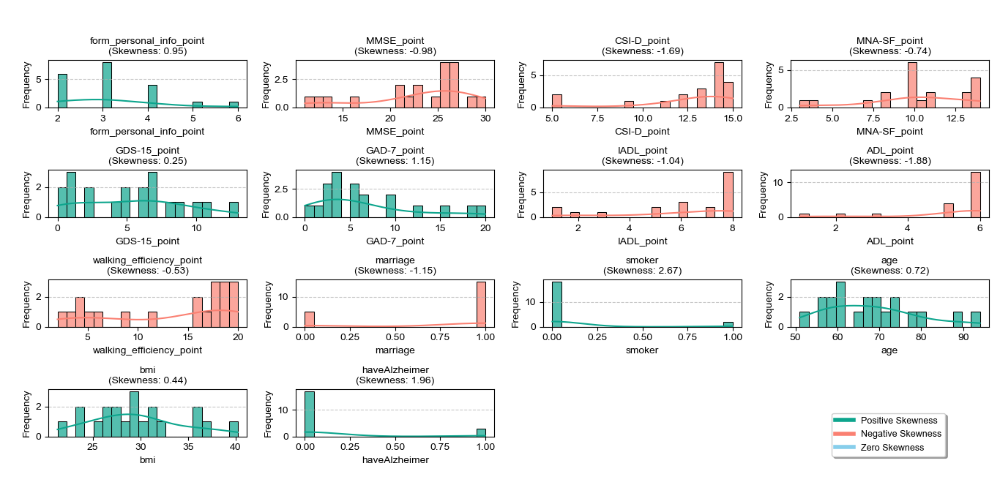

# dataset-analysis
# Alzheimer's Disease Data Analysis

This project focuses on analyzing data related to Alzheimer's disease. It involves cleaning, visualizing, and analyzing the data to identify patterns and relationships between features.

---

## Table of Contents
- [Project Description](#project-description)
- [Dataset](#dataset)
- [How to Run](#how-to-run)
- [Results and Visualizations](#results-and-visualizations)
- [Dependencies](#dependencies)
- [Contributing](#contributing)
- [License](#license)

---

## Project Description
This project includes the following steps:
1. **Data Cleaning**: Removing duplicate rows and handling missing values.
2. **Data Visualization**: Creating various plots to explore data distributions and feature relationships.
3. **Data Analysis**: Performing statistical analysis to identify patterns in the data.

---

## Dataset
The dataset is loaded from `dataset.csv`. It includes information such as age, BMI, cognitive test scores, and Alzheimer's disease status.

---

## How to Run
To run this project, follow these steps:

1. Clone the repository:
   ```bash
   git clone https://github.com/zfarzaneh/dataset-analysis.git

## Results and Visualizations

| **Plot 1** | **Plot 2** |
|------------|------------|
|  |  |
| **Class Distribution** | **Correlation Matrix** |
|  |  |
| **Data Distribution** | **Feature Distributions (Boxplot)** |
|  |  |
| **Q-Q Plots for Dataset Columns** | **Skewness Distribution of All Numerical Features** |
**To view more plots, please refer to the [df_plots](df_plots/) folder**
