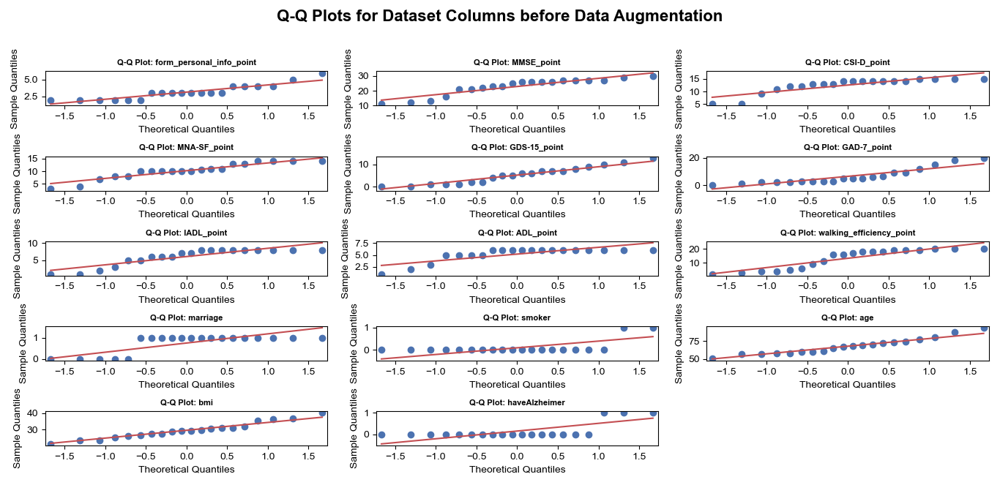

# Alzheimer's Disease Data Analysis

This project focuses on analyzing data related to Alzheimer's disease. It involves cleaning, visualizing, and analyzing the data to identify patterns and relationships between features.

---

## Table of Contents
- [Project Description](#project-description)
- [Dataset](#dataset)
- [How to Run](#how-to-run)
- [Results and Visualizations](#results-and-visualizations)
- [Dependencies](#dependencies)
- [Contributing](#contributing)
- [License](#license)

---

## Project Description
This project includes the following steps:
1. **Data Cleaning**: Removing duplicate rows and handling missing values.
2. **Data Visualization**: Creating various plots to explore data distributions and feature relationships.
3. **Data Analysis**: Performing statistical analysis to identify patterns in the data.

---

## Dataset
The dataset is loaded from `dataset.csv`. It includes information such as age, BMI, cognitive test scores, and Alzheimer's disease status.

---

## How to Run
To run this project, follow these steps:

1. Clone the repository:
   ```bash
   git clone https://github.com/zfarzaneh/dataset-analysis.git

## Results and Visualizations

| **Class Distribution** | **Correlation Matrix** |
|------------------------|------------------------|
|  |  |

| **Data Distribution** | **Feature Distributions (Boxplot)** |
|-----------------------|-------------------------------------|
|  |  |

| **Q-Q Plots for Dataset Columns** | **Skewness Distribution of All Numerical Features** |
|-----------------------------------|----------------------------------------------------|
|  |  |


**To view more plots, please refer to the [df_plots](df_plots/) folder**


| مرحله | حافظه | جهت‌یابی | قضاوت و حل مسئله | فعالیت‌های اجتماعی | عادات و سرگرمی‌ها | مراقبت شخصی | خلق‌وخو | CDR Scale | GDS-Reisberg Stage |
|---|---|---|---|---|---|---|---|---|
| طبیعی | بدون فراموشی یا فراموشی جزئی و ناپایدار | کاملاً جهت‌یافته | حل مشکلات روزمره؛ رسیدگی به امور تجاری و مالی به خوبی؛ قضاوت خوب در رابطه با عملکرد گذشته | عملکرد مستقل در سطح معمول، خرید، داوطلبانه و گروه‌های اجتماعی | زندگی در خانه، سرگرمی‌ها و علایق فکری به خوبی حفظ شده است | کاملاً قادر به مراقبت از خود | نرمال | 0-0.5 | 1-2 |
| اختلال شناختی خفیف (MCI) | فراموشی جزئی مداوم؛ یادآوری جزئی از وقایع؛ نقص حافظه عینی در هنگام مصاحبه | به جز مشکل جزئی در رابطه زمانی کاملاً جهت‌یافته | کاهش جزئی در حل مشکلات، شباهت‌ها و تفاوت‌ها | اختلال جزئی قادر به عملکرد مستقل در این فعالیت‌ها نیست اگرچه ممکن است هنوز در برخی از آنها شرکت کند. به نظر می‌رسد در بازرسی اتفاقی طبیعی است | زندگی در خانه، سرگرمی‌ها و علایق فکری کمی مختل شده است | کاملاً قادر به مراقبت از خود | کمی انکار به عنوان دفاع؛ اضطراب خفیف | 1-2 | 3 |
| زوال عقل اولیه | از دست دادن حافظه متوسط؛ بیشتر برای رویدادهای اخیر مشخص است؛ از دست دادن حافظه در فعالیت‌های روزمره اختلال ایجاد می‌کند | مشکل متوسط در رابطه زمانی؛ برای مکان در محیط شناخته شده جهت‌یافته است؛ ممکن است در جاهای دیگر دچار اختلال جهت‌یابی جغرافیایی شود | مشکل متوسط در رسیدگی به مشکلات؛ شباهت‌ها و تفاوت‌ها، قضاوت اجتماعی معمولاً حفظ می‌شود | قادر به عملکرد مستقل در این فعالیت‌ها نیست اگرچه ممکن است هنوز در برخی از آنها شرکت کند. به نظر می‌رسد در بازرسی اتفاقی طبیعی است | اختلال خفیف اما قطعی عملکرد در خانه؛ کارهای دشوارتر رها شده است. سرگرمی‌ها و علایق پیچیده تر رها شده است | کاملاً قادر به مراقبت از خود | نیاز به راهنمایی | 2-3 | 4 |
| زوال عقل خفیف تا متوسط | از دست دادن شدید حافظه؛ فقط مطالب بسیار آموخته شده حفظ می‌شود؛ اطلاعات جدید به سرعت از بین می‌رود | مشکل شدید در روابط زمانی؛ معمولاً نسبت به زمان و اغلب نسبت به مکان گمراه شده است؛ فقط به شخص جهت‌یافته است | شدیداً در رسیدگی به مشکلات، شباهت‌ها و تفاوت‌ها مختل شده است. قضاوت اجتماعی معمولاً مختل شده است | بدون عملکرد مستقل خارج از خانه؛ به اندازه کافی خوب است که به عملکردهای خارج از خانه برده شود | فقط کارهای ساده حفظ می‌شود. علایق بسیار محدود، ضعیف نگهداری می‌شود | نیاز به کمک در ADL‌های اساسی؛ ممکن است بی اختیاری ادرار شود | انکار غالب است. کدر شدن عاطفی؛ عقب‌نشینی | 2-3 | 5-6 |
| زوال عقل شدید | از دست دادن شدید حافظه؛ فقط تکه‌هایی باقی می‌ماند؛ در نهایت قادر به برقراری ارتباط کلامی نیست | معمولاً نسبت به زمان و اغلب نسبت به مکان گمراه شده است؛ فقط به شخص جهت‌یافته است | قادر به قضاوت یا حل مسئله نیست | بدون عملکرد مستقل خارج از خانه؛ خیلی بیمار است که به عملکردهای خارج از خانه برده شود | عملکرد قابل توجهی در خانه وجود ندارد | وابستگی در ADL‌های اساسی؛ بی اختیاری ادرار شود | هذیان؛ اضطراب و تحریک؛ رفتار وسواسی تکراری اختلال ریتم شبانه‌روزی؛ هذیان | 3-3 | 6-7 |
